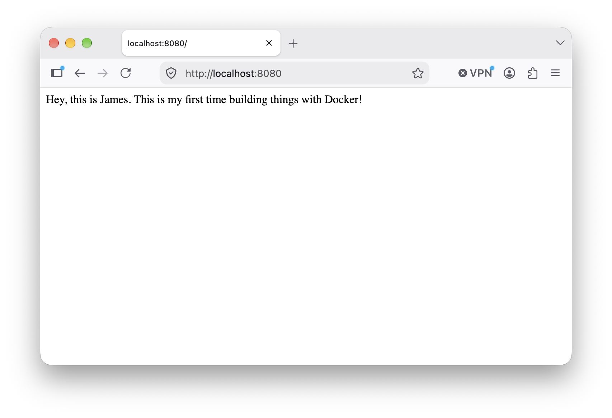

# Flask in a Docker Container

A minimal Flask web app packaged to run inside a Docker container — a small project for learning how to containerize a Python web application. The app serves a single page with a greeting, which Flask listens for on port `5000` inside the container.



## Run it

Build the image and start a container, mapping a host port (here `1169`) to Flask's port `5000` inside the container:

```bash
docker build -t flask-tutorial .
docker run -p 1169:5000 flask-tutorial
```

Check that it's up:

```bash
docker ps
```

## Viewing it from my own machine

The container runs on a remote server, so open an SSH tunnel that forwards a local port to the container's host port:

```bash
ssh jzii2024@lambda.compute.cmc.edu -p 5055 -L localhost:8080:10.253.1.15:1169
```

With the tunnel open, visit [http://localhost:8080](http://localhost:8080) in a browser.

The request travels through three ports:

| Port   | Where it lives                         |
| ------ | -------------------------------------- |
| `8080` | My laptop, opened by the SSH tunnel   |
| `1169` | The remote host, set by `docker run -p` |
| `5000` | Inside the container, where Flask listens |

## Files

- `app.py` — the Flask application (one route: `/`)
- `Dockerfile` — image build instructions
- `requirements.txt` — pinned Python dependencies
- `webpage.png` — screenshot of the running page
